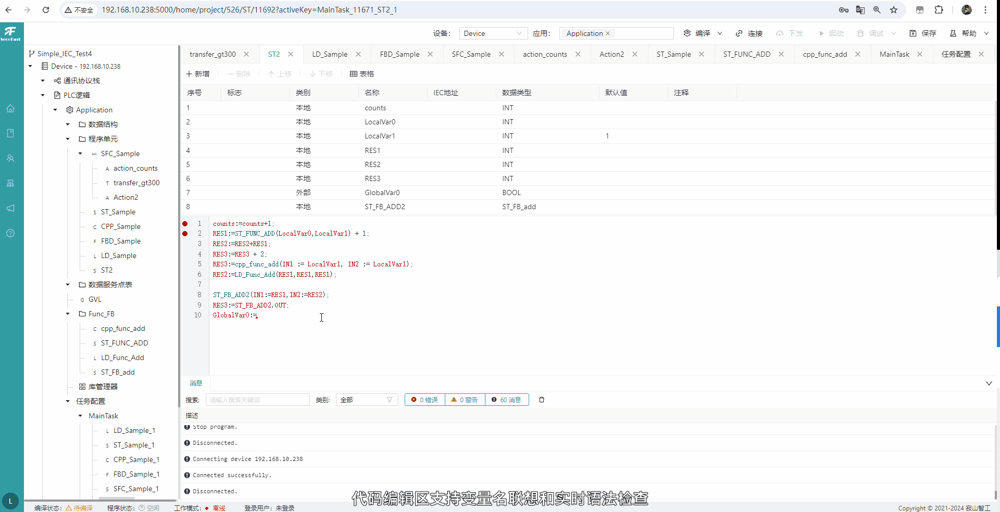

# SecoFast
[中文](./doc/README_ZH.md) | English
[SecoFast](https://www.jishan-tech.com/home) is a Endogenous Security, Cross-Device, IT-OT Converged Industrial Edge Computing Software Suite (Programming Configuration IDE Software, Runtime RTE Software)

The Programming Configuration IDE software adopts a B/S (Browser/Server) architecture. The server can be deployed on a local area network server in the industrial site or directly integrated into control devices. The Runtime RTE software is loaded onto edge control devices and can be adapted to various industrial control computers, industrial gateways, and industrial control boards.

# Main Feature
* Supports initial device self-discovery
* Programming languages supported: Ladder Diagram (LD), Function Block Diagram (FBD), Structured Text (ST), C++
* Supports custom data types
* Provides IEC standard libraries and supports custom libraries
* Prioritized multitasking operation with monitoring of each task's running status
* Compilation: Allows viewing of call trees and intermediate code, provides compilation result information
* Online debugging: Supports breakpoints, single-step execution, slow execution, variable monitoring, and variable forcing
* Integrated Python development and runtime environment, with access to PLC process variables
* Provides simulation operation based on a virtual machine
* Provides runtime diagnostic logs
* Built-in OPC-UA Server and MQTT Broker
* Supports Modbus and EtherCAT protocols

# Supported Platforms
* Linux x86_64
* Linux aarch64
* Linux aarch32

# Documentation and Support
## Online Trial
* [SecoFast Online Trial](http://www.softplc.online)
## Online User Guide
* [SecoFast User Guide](https://doc.jishan-tech.com/IDE_Software/1Function_Overview.html)